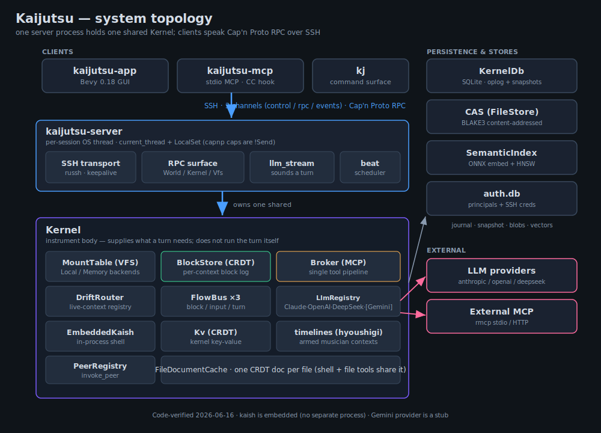
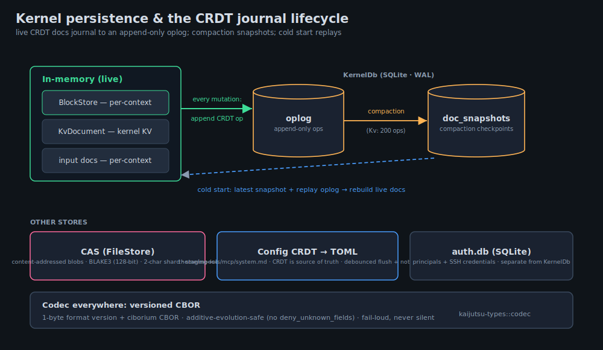
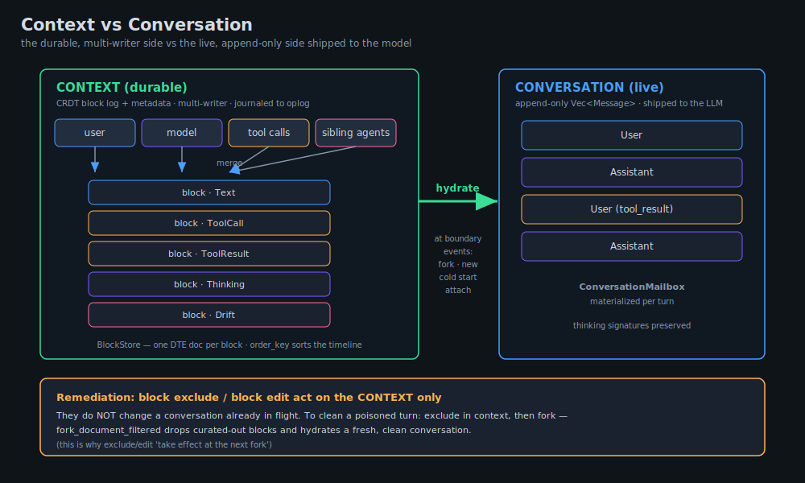
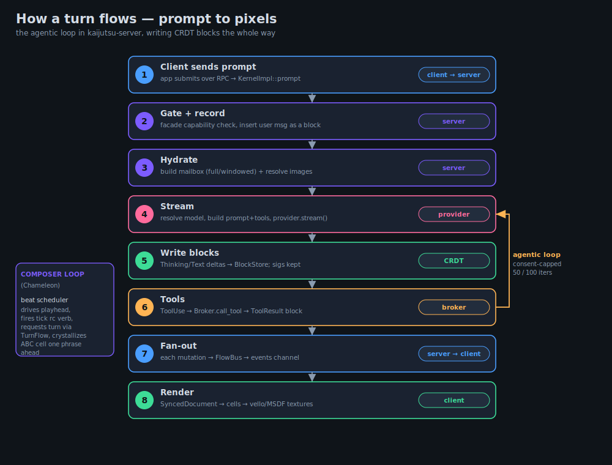
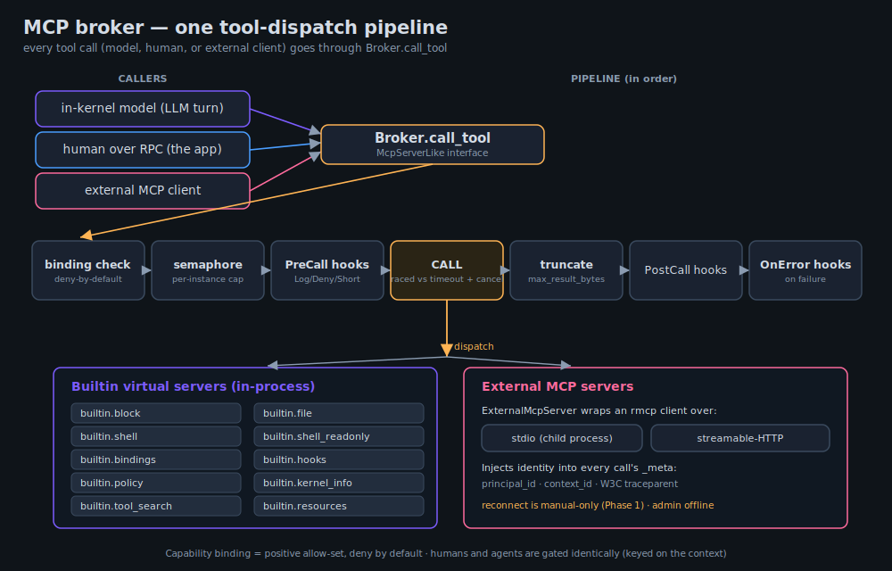
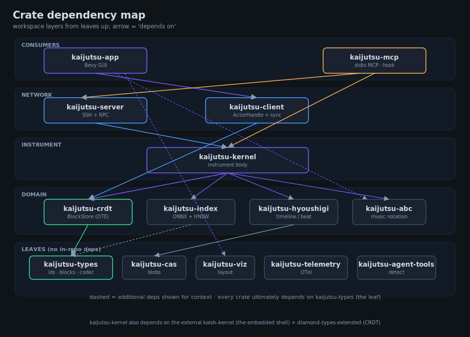

# Kaijutsu Architecture

*A map of the system as it actually is, drawn from the code on 2026-06-16.*

This directory is the synthesized, top-level view of kaijutsu. It was built by
reading the code crate-by-crate, **not** by trusting prose — several long-standing
design docs describe things the code no longer does (see
[Stale docs & surprises](#stale-docs--surprises)). Where this document and an
older doc disagree, the code wins and this document tries to say so.

## Contents

- **[overview](README.md)** — this file: the system in one read.
- **[foundation.md](foundation.md)** — `kaijutsu-types` + `kaijutsu-crdt` + the
  Cap'n Proto wire schema. The shared vocabulary and the CRDT data model.
- **[kernel.md](kernel.md)** — `kaijutsu-kernel`: the orchestration hub (VFS,
  block store, MCP broker, LLM, drift, KV, persistence, the embedded shell).
- **[server.md](server.md)** — `kaijutsu-server`: SSH transport, the Cap'n Proto
  RPC surface, LLM streaming, the beat scheduler, auth.
- **[client.md](client.md)** — `kaijutsu-client`: the `Send+Sync` actor bridge and
  the client-side CRDT mirror.
- **[app.md](app.md)** — `kaijutsu-app`: the Bevy 0.18 GUI and its render pipeline.
- **[supporting.md](supporting.md)** — `kaijutsu-mcp`, `-cas`, `-index`,
  `-hyoushigi`, `-abc`, `-viz`, `-telemetry`, `-agent-tools`.

Diagrams referenced below live in [`diagrams/`](diagrams/).

---

## What kaijutsu is

Kaijutsu is a cybernetic system for multi-user, multi-model, multi-context
collaboration. Concretely, it is:

- **one kernel** that owns context data, model interactions, a virtual
  filesystem, and tools;
- **one server process** that holds a single shared kernel and exposes it over
  **SSH carrying Cap'n Proto RPC**;
- **many clients** — a Bevy GUI (`kaijutsu-app`), a stdio MCP server
  (`kaijutsu-mcp`, used as an agent backend and as a Claude Code hook), and the
  `kj` command surface — that all speak the same RPC.

The organizing idea: **context isn't stored and replayed, it is *generated*.**
The kernel holds state
and mounts; when a model needs a payload, the system walks the kernel and emits a
fresh conversation. "Everything is a kernel" — a kernel can even be mounted inside
another kernel through the VFS.

---

## Process & transport model

There is exactly **one `Kernel` per server process**, shared across every
connection (`create_shared_kernel`, `kaijutsu-server/src/rpc.rs:974`). Clients do
not get private kernels; isolation is by *context*, not by process.

A connection is an **SSH session that opens three channels**: control, rpc, and
events (`kaijutsu-client/src/ssh.rs:181`). The rpc channel carries a Cap'n Proto
`twoparty` RPC system; the events channel carries server→client callbacks
(block events, resource events).

Each RPC session runs on its **own OS thread** with a `current_thread` Tokio
runtime and a `LocalSet` (`kaijutsu-server/src/ssh.rs:711`). This is forced by
`capnp-rpc`, which stores capabilities in `Rc<RefCell<…>>` (`!Send`). A
`catch_unwind` contains per-connection panics so one wedged session can't crash
the server. Dead peers are reaped by SSH keepalive (30 s × 3 ≈ 90 s); an
activity-gated watchdog warns only on genuine idle wedges
(`kaijutsu-server/src/ssh.rs`).

On the client side, the same `!Send` constraint is bridged by **`ActorHandle`**
(`kaijutsu-client/src/actor.rs:617`): a `Clone + Send + Sync` facade that funnels
every call through a bounded mpsc into an actor task running on a `LocalSet`. The
Bevy app runs that actor on a dedicated "bootstrap" thread and talks to it from
ECS systems via channels.

**Authentication** is SSH public key → `PrincipalId` lookup in a small SQLite
`auth.db` (`kaijutsu-server/src/auth_db.rs`). Authorization at the transport layer
is binary (key present = allowed); fine-grained authority lives later, in the
capability allow-set on each context (see [Trust model](#trust-model)).

---

## The kernel: an orchestration hub

`Kernel` (`kaijutsu-kernel/src/kernel.rs:40`) is the coordination center. Every
field is `Arc`/`OnceLock`-wrapped for shared async ownership. It owns or wires
together:

| Subsystem | Type | Role |
|---|---|---|
| VFS | `Arc<MountTable>` | Path-routed multiplexer over Local/Memory backends; `Kernel` itself impls `VfsOps` so a kernel can be mounted. |
| CRDT documents | `SharedBlockStore` | The durable, multi-writer conversation block log (per-context CRDT). Registered into the broker at startup, not owned by `Kernel` directly. |
| Tool dispatch | `Arc<Broker>` | The **single** MCP tool pipeline — builtins (virtual in-process servers) and external rmcp servers, with capability gating and hooks. |
| Context registry | `SharedDriftRouter` | Single source of truth for live contexts; also the drift staging queue + dead-letter/lost+found. |
| Events | `FlowBus` ×3 | Topic pub/sub for block events, input-doc events, and autonomous-turn requests. |
| Models | `LlmRegistry` | Named providers + default; alias resolution. |
| Peers | `PeerRegistry` | Reverse-RPC callbacks (the Bevy app, external MCP) for `invoke_peer`. |
| Blobs | `Arc<FileStore>` (CAS) | Content-addressed binary store (images, large payloads). |
| KV | `Arc<Kv>` | Persistent CRDT key-value store (client current-context, etc.). |
| Timelines | `DashMap<ContextId, SharedTimeline>` | Per-context hyoushigi beat engines (armed composer contexts only). |
| Persistence | `KernelDb` (SQLite) | ~20 tables: contexts, edges, documents, oplog+snapshots, bindings, hooks, KV journal. |

The kernel **does not run an LLM turn itself** — that is the server's job
(`llm_stream.rs`). The kernel supplies everything a turn needs: tool dispatch,
block storage, event broadcast, context lookup, hydration, and drift staging.

Embedded inside the kernel (this is the big change from the old design) is
**kaish**, the shell. `EmbeddedKaish`
(`kaijutsu-kernel/src/runtime/embedded_kaish.rs:56`) runs the kaish interpreter
**in-process** against the VFS and a CRDT-backed file cache. There is no separate
kaish process and no Unix socket.

---

## The data model: context vs conversation

This is the distinction that most shapes the system, so it gets its own diagram.

- **Context** is the durable side: a CRDT block log plus metadata
  (model/provider, fork lineage, exclusions, edits). It is **multi-writer** — the
  user, the model, tool calls, and sibling agents all append concurrently and the
  CRDT merges. It is journaled to `KernelDb.oplog` and compacted to
  `doc_snapshots`.

- **Conversation** is the live side: an append-only `Vec<Message>` shipped to the
  LLM, materialized per-turn by the `ConversationMailbox`
  (`kaijutsu-kernel/src/llm/mailbox.rs`). It is **hydrated** from the context at
  boundary events (fork, new, cold start, attach) and append-only thereafter.

Because the conversation is hydrated, **`block exclude` / `block edit` only take
effect at the next hydration boundary — typically a fork.** To remediate a
poisoned conversation (a giant tool output, a bad turn) you exclude in the
context, then fork; the fork hydrates a clean conversation.

### Blocks, ids, ticks, and order

A **block** is the unit of conversation (`BlockKind`: Text, Thinking, ToolCall,
ToolResult, Drift, File, Error, Notification, Resource, Trace). Three different
"coordinates" attach to a block and are routinely confused — they are distinct:

- **`BlockId` = identity.** `(ContextId, PrincipalId, seq)`. Globally unique,
  coordinate-based (no central counter), never changes. The `BTreeMap` keying it
  orders **principal-major**, which is *not* timeline order — always use
  `block_ids_ordered()` for anything position-dependent.
- **`Tick` = shared timeline coordinate.** A logical `i64` position on the
  timeline; **multiple blocks can share a tick** (coalesced events in one beat).
  It answers "*when*," not "which."
- **`order_key` = sibling sort order.** A base-62 fractional-index string assigned
  at insert; this is what `block_ids_ordered()` actually sorts by. Decoupled from
  `Tick` on purpose (a stale tick counter used to mis-sort appends).

Two more orthogonal axes that read like overlap but aren't:

- **`BlockKind`** = the structural role of the event (a tool call, a drift, …).
- **`ContentType`** = how the block's text renders (Plain, Markdown, Svg, Abc,
  Image). A `ToolResult` can have `ContentType::Svg`; they vary independently.

CRDT mechanics live in `kaijutsu-crdt`, built on a fork of diamond-types
(`diamond-types-extended`). The **target** store is `BlockStore`: one DTE document
*per block* for text, plus per-field Last-Write-Wins Lamport timestamps for
metadata. A **legacy** `BlockDocument` (single shared DTE doc) is still public and
in use during an unfinished migration — see [Tensions](#tensions--known-debt).

---

## How a turn flows

The end-to-end path, prompt to pixels:

1. **Client → server.** The app sends a prompt (or submits the compose input)
   over RPC. `KernelImpl::prompt` (`rpc.rs:2563`) checks the context's facade
   capability, inserts the user message as a CRDT block, and calls
   `spawn_llm_for_prompt` (`llm_stream.rs:184`).
2. **Hydrate.** The turn driver acquires the per-context conversation lock,
   reads the hydration policy (full vs windowed), and hydrates a
   `ConversationMailbox` from the block store. Image blocks are resolved from CAS.
3. **Stream.** It resolves provider/model, builds the system prompt (static base
   + rc-script sections + situational addendum) and tool definitions (via the
   broker), and calls `provider.stream(...)`. Providers are a closed `enum`
   (`llm/mod.rs:353`): Claude and OpenAI-compatible/DeepSeek are real; **Gemini is
   a stub** that returns `Unavailable`.
4. **Blocks.** `StreamEvent`s (Thinking/Text deltas, ToolUse, Done) are written
   **directly into the CRDT block store** as they arrive. Thinking blocks keep
   their provider `signature` for cross-turn reasoning continuity.
5. **Tools.** On `ToolUse`, the server calls `dispatch_tool_via_broker`. The
   broker checks the capability binding, acquires a per-instance semaphore,
   runs pre/post/error hooks, and routes to a builtin engine (block/file/shell/…)
   or an external rmcp server. The result becomes a `ToolResult` block.
6. **Fan-out.** Every block mutation publishes a `BlockFlow` event on the
   `FlowBus`. Server-side subscribers push it down the events channel.
7. **Client mirror.** `kaijutsu-client`'s `SyncedDocument` applies events into a
   local CRDT mirror, buffering out-of-order events until their `BlockInserted`
   arrives (the cross-topic ordering fix).
8. **Render.** The Bevy app copies mirror blocks into per-block cells and renders
   each to its own GPU texture via the two-pass vello/MSDF pipeline.

For **composer contexts** (the Chameleon music work), a second loop runs: the
**beat scheduler** (`kaijutsu-server/src/beat.rs`) drives an event-counted
playhead, fires the `tick` rc verb, requests a turn via `TurnFlow`, and on
completion crystallizes the turn's output as an ABC cell one phrase ahead on the
hyoushigi timeline.

---

## Tool dispatch: the MCP broker

Every tool call — whether from the in-kernel model, a human over RPC, or an
external MCP client — flows through **one** pipeline: `Broker::call_tool`
(`kaijutsu-kernel/src/mcp/broker.rs:1184`). Everything that can be called
implements `McpServerLike`.

- **Virtual builtin servers** are registered in-process under `builtin.*` ids:
  `builtin.block`, `builtin.file`, `builtin.shell` / `builtin.shell_readonly`,
  `builtin.bindings`, `builtin.hooks`, `builtin.policy`, `builtin.resources`,
  `builtin.kernel_info`, `builtin.tool_search`.
- **External servers** (`ExternalMcpServer`) wrap an `rmcp` client over stdio or
  streamable-HTTP and inject kaijutsu identity (`principal_id`, `context_id`,
  W3C trace) into every call's `_meta`.

Dispatch order: binding (capability) check → per-instance concurrency semaphore →
PreCall hooks → the call (raced against a timeout and a cancel token) → truncate
oversized results → PostCall hooks → (on failure) OnError hooks. Hooks can run
inline kaish bodies and recurse up to a bounded depth.

---

## Trust model

Kaijutsu is **not** security-first; it runs as the user, in a shared-trust kernel.
Capabilities are ergonomic nudges, not a sandbox boundary. The model:

- **Deny by default.** A context's `ContextToolBinding` is a positive allow-set;
  an empty binding grants nothing (`mcp/binding.rs`).
- **One predicate, one gate.** A single `allows(&Capability)` check, and a single
  shared RPC facade gate — **humans and agents are gated identically**, keyed on
  the *context binding*, not on who called.
- **Authority axes are separate.** `AllInstances` does not imply admin, rc-write,
  or any of the five authorities (`drive`/`fork`/`drift`/`transport`/`operator`)
  that gate escalation-relevant `kj` verbs.

A practical consequence worth knowing: widened role loadouts only reach
**newly-created** contexts. Live contexts keep their old binding until re-created
or until the kernel restarts (rc scripts fire at lifecycle boundaries, not
retroactively).

---

## Persistence at a glance

| Store | Backed by | Holds |
|---|---|---|
| `KernelDb` | SQLite (WAL) | Contexts, edges, presets, workspaces, document registry, CRDT **oplog + snapshots**, input-doc oplog, per-context shell cwd/env, tool bindings, hooks, cache breakpoints, hydration markers. |
| CRDT documents | in-memory + oplog | Live block stores and the KV doc; cold start = latest snapshot + oplog replay. |
| CAS (`FileStore`) | sharded files | Content-addressed blobs (BLAKE3-truncated 128-bit hash), images, large bodies. |
| `Kv` | CRDT doc in oplog | Kernel key-value store (JSON envelopes, advisory TTL, compaction at 200 ops). |
| Config | CRDT doc → TOML | `theme.toml`, `models.toml`, `mcp.toml`, `system.md`; CRDT is source of truth, disk is a debounced flush + reload-on-change. |
| rc scripts | real files | `~/.config/kaijutsu/rc/...` lifecycle scripts; seeded once from embedded defaults. |
| `auth.db` | SQLite | Principals + SSH credentials. |

Codec everywhere is **versioned CBOR** (`kaijutsu-types/src/codec.rs`): a 1-byte
format version then ciborium CBOR, fail-loud, additive-evolution-safe.

---

## Crate dependency map

The workspace layers cleanly from leaves up:

- **Leaves** (no in-repo deps): `kaijutsu-types`, `kaijutsu-cas`,
  `kaijutsu-abc`, `kaijutsu-viz`, `kaijutsu-telemetry`, `kaijutsu-agent-tools`.
- **`kaijutsu-crdt`** depends only on `-types` (+ `diamond-types-extended`).
- **`kaijutsu-index`** depends only on `-types` (ONNX + HNSW + SQLite).
- **`kaijutsu-hyoushigi`** depends on `-types` + `-cas`.
- **`kaijutsu-kernel`** sits on `-types`, `-crdt`, `-cas`, `-index`,
  `-hyoushigi`, `-abc`, `-telemetry`, plus the external `kaish-kernel`.
- **`kaijutsu-server`** depends on `-kernel`, `-crdt`, `-types`, `-index`,
  `-telemetry`.
- **`kaijutsu-client`** depends on `-crdt`, `-types`, `-telemetry`.
- **`kaijutsu-app`** depends on `-client`, `-crdt`, `-types`, `-abc`, `-viz`,
  `-telemetry`.
- **`kaijutsu-mcp`** is the terminal consumer: it depends on `-kernel`, `-server`,
  `-client`, `-crdt`, `-types`, `-agent-tools`, `-telemetry`.

---

## Stale docs & surprises

Reading the code surfaced several places where prose lags reality. Recorded here
because the gap itself is architecturally informative:

- **kaish is embedded, not a separate process.** An earlier design (the old
  `design-notes.md`, since removed) had kaish running as its own process over a
  Unix socket with seccomp sandboxing. The code embeds it in-kernel
  (`runtime/embedded_kaish.rs`); there is no socket, no separate process, no
  sandbox — so the crash-isolation and seccomp story from that era does not hold.
- **Gemini is a stub.** The `unrig` effort planned a bespoke Gemini provider, but
  `llm/gemini/mod.rs` returns `Unavailable` for both prompt and stream and
  advertises three models nobody can call. Claude and the OpenAI-compatible core
  (incl. DeepSeek) are the real providers. (Tracked in `../issues.md`.)
- **`@alias` routing is unbuilt.** The old `@opus`/`@bash`/`@amy` addressing idea
  was never built; the live mechanism is the peer registry + `invoke_peer`, not
  `@`-routing.
- **External MCP admin is offline.** The capnp methods exist but
  `list_mcp_servers` returns empty; external-server registration is deferred.
- **Two CRDT storage impls coexist.** `BlockStore` (target) and `BlockDocument`
  (legacy) are both public; the legacy path silently drops newer fields.

---

## Tensions & known debt

The big-ticket items the code review surfaced (all recorded in
[`../issues.md`](../issues.md), not fixed here):

- **`rpc.rs` monolith** (~7,400 lines, one `impl kernel::Server`) and **`KernelDb`
  god-table** (~5,900 lines, ~20 tables behind one mutex) are the two largest
  single-file concentrations.
- **Dual CRDT storage** with silent field-dropping on the legacy path.
- **Silent fallbacks** in a few kernel paths (broker tool-listing returns empty on
  error; binding resolve falls back to deny-all) — counter to the "crash over
  corrupt/confuse" stance.
- **Cap'n Proto ordinal reuse** after method removals, asserted safe by comment.
- **UTF-8 byte-vs-char offset hazard** in the file edit path.
- **App state-flag duplication** (`FocusArea` + `ActiveSurface` + `InputMode`).

See each deep-dive's *Smells* section and `docs/issues.md` for the full list with
file:line pointers.
